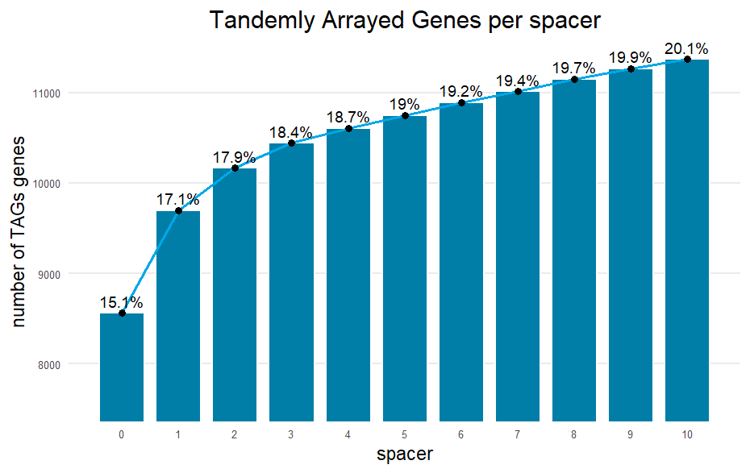
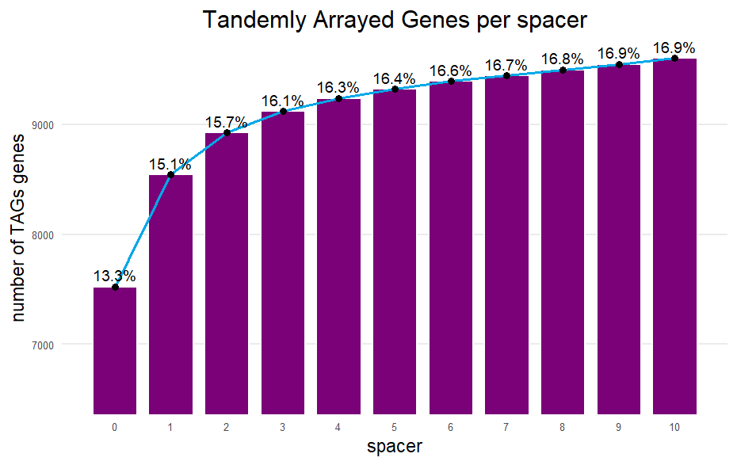
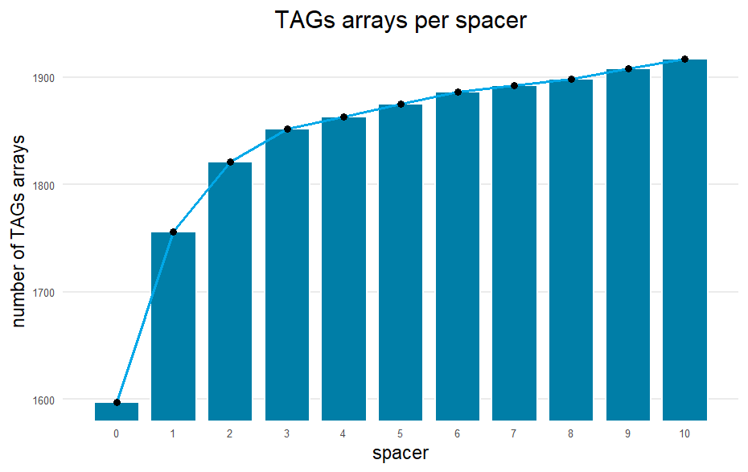
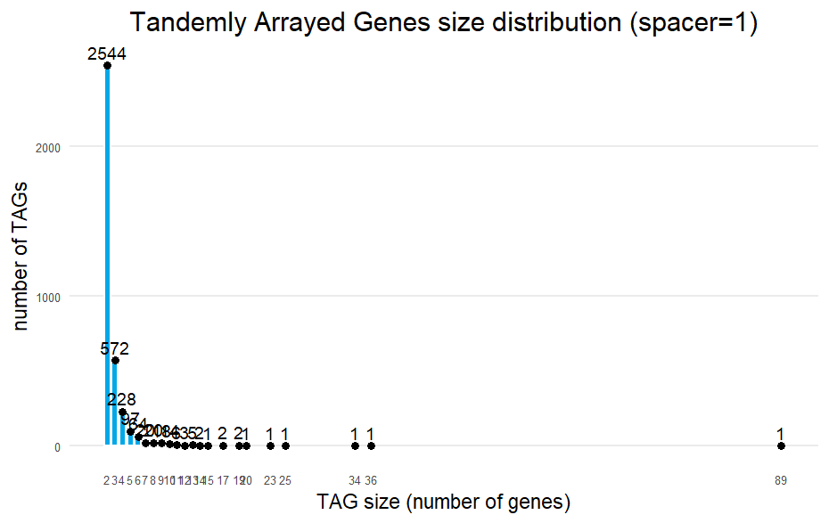
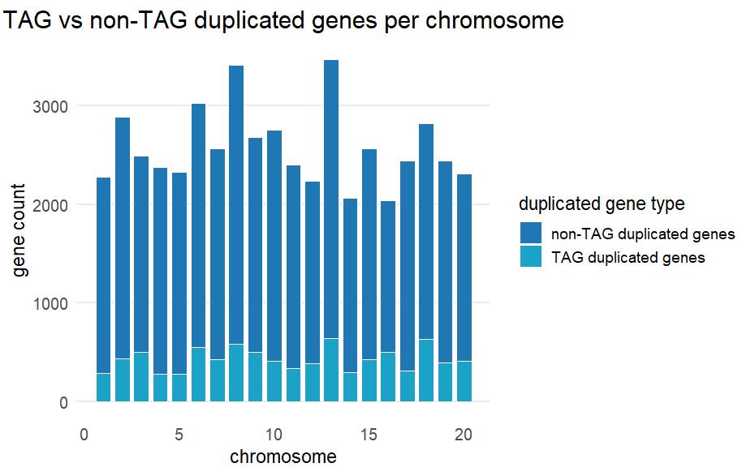
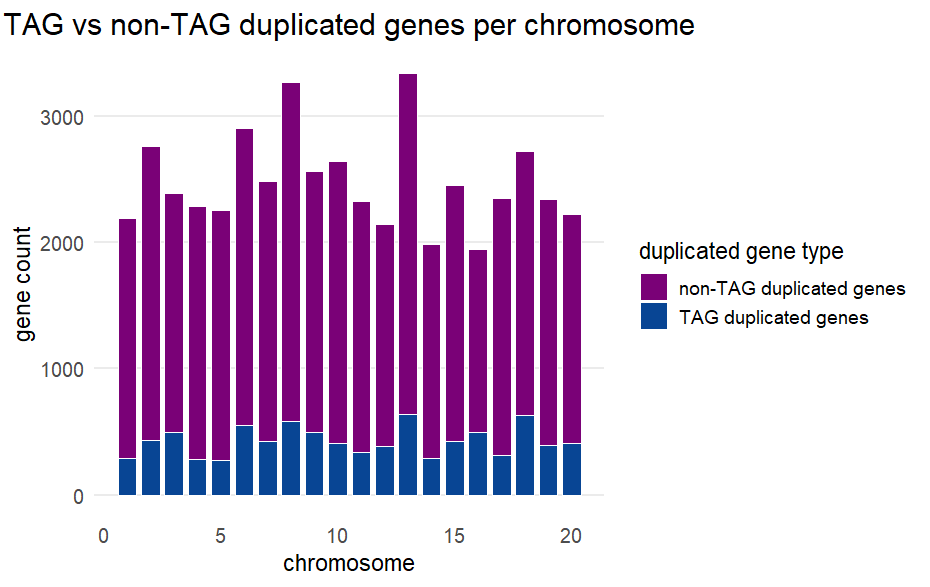

# Duplicated genes

# On Glycine max

Studies in Glycine max show the organism to have around 70-75% of its genes as duplicated genes [^4][^5], due to its paleopolyploid nature with 2 rounds of whole-genome duplications. Yang et al. (2013) [^5] performed their analysis on genomes taken from Plant Genome Duplication Database and used the MCScan tool to perform syntenic black dedtection, classification of dup genes and downstream analysis.

Most studies we found on duplicated genes in Glycine max were family-focused, i.e. they studied the duplication patterns of specific gene families such as PP2C, WRKY genes.., rather than performing a genome-wide analysis of duplicated genes. Some performed genome-wide analysis using BAC sequences and mapping to identify duplicates.

## On pipeline 1

Starting from blast results, we identify duplicated genes in the genome.

Done some diagnostics plots on the blast results to see how identity and coverage are distributed (script:[`scripts/blast_diagnostics.py`](../scripts/blast_diagnostics.py))


| id distribution | coverage distribution | id vs coverage |
|-----------------|-----------------------|----------------|
|  |  |  |

The default thresholds to rub blastp used in our pipeline: 30% identity, 50% coverage => 99% of genes are duplicated genes (89598 isoforms filtered to 56680 genes, 56144 out of them are duplicated genes)

In [^3], the work was performed on rice, with a relatively higher number of initial genes (42534, higher than arabidpsis studies and closer to our number), they used to filtering strategies:  
- 30% identity and 70% coverage => low stringency dataset (reduced to ~18k)
- 50% identity and 90% coverage => high stringency dataset (reduced to ~9k)


## On datasets

At the start, on an exploratory phase, we tried performing the full analysis on a low stringency dataset (30% id, 50% cov) to check initial resultsm knowing that we can use a more stringent dataset later on based on filtration thresholds. The dataset had a 99% duplication rate which led to a pretty exhaustive search space to work with in pipeline 2 in particular, requiring really high computational power to run (yazid part here).
From a large search space of the righ filtration thresholds, we gor preliminary statistics on duplicated genes as well as some analysis results that made us judge better what to go for, for the rest of the analysis.  
Running pipeline on different thresholds to see how results change, by comparing number of duplicated genes in each file in `output/clusters/` containing gene families detected with different thresholds
```bash
./scripts/dups_get_ratio.sh
# -- outputs in output/statistics/duplication_ratios.tsv this table
```

| cluster_file | duplicated_genes | total_genes | duplication_ratio |
|--------------|------------------|-------------|-------------------|
| protein_families_filtered_blast_results_id30_qcov50_scov50_wcol12_network.tsv | 56145 | 56679 | 0.9905 |
| protein_families_filtered_blast_results_id30_qcov70_scov70_wcol12_network.tsv | 54271 | 56679 | 0.9575 |
| protein_families_filtered_blast_results_id50_qcov90_scov90_wcol12_network.tsv | 49334 | 56679 | 0.8704 |
| protein_families_filtered_blast_results_id70_qcov90_scov90_wcol12_network.tsv | 44925 | 56679 | 0.7926 |

*consider filtering by # of protein hits, [scripts/top5_per_protein.py](../scripts/top5_per_protein.py) for reference*

***MCScanX** is a widely used tool for detecting and classifying duplicated genes. It provides scripts to classify gene duplicates from blast results and gene position files. Tried to run it to check what results it might give*

> To run MCScanX try to follow these steps or else might give an error:
> * Create a folder called gm/ and put inside it gm.blast (renamed raw blast results with 12 columns) and gm.gff (gff of the shape: chr# start end gene_id)
> * gff taken from prot_longest_info.csv where peptide_id are taken as gene_id (or genomicRanges file taken from R, there s a command to create this file)
> * gff chr# should be of the form gm1, gm2, ..., gm20
> make sure both files are tab seperated and not space seperated
> * run MCScanX: `<path_to_mcscanx>/MCScanX <path_to_gm_dir>/gm`

Results from MCScanX:
```text
$ ./MCScanX gm
Reading BLAST file and pre-processing
Generating BLAST list
0 matches imported (9336543 discarded)
0 pairwise comparisons
0 alignments generated
Pairwise collinear blocks written to gm.collinearity [85.624 seconds elapsed]
Writing multiple syntenic blocks to HTML files
...
Done! [20.653 seconds elapsed]
```
```text
$ ./duplicate_gene_classifier gm
Reading BLAST file and pre-processing
Generating BLAST list
0 matches imported (9336543 discarded)
0 pairwise comparisons
0 alignments generated
Type of dup     Code    Number
Singleton       0       56181
Dispersed       1       0
Proximal        2       0
Tandem  3       0
WGD or segmental        4       0
```

It is also recommended by the tool developers to filter the BLAST results to keep only the top 5 hits per gene in a command like this (tried it but results not too different except for number of discarded matches is much less):

```bash
# tmux new -s mcscanx_blast
makeblastdb -in ../../data/peptides_longest.fa -dbtype prot -out peptides_db
blastp -query ../../data/peptides_longest.fa -db peptides_db   -evalue 1e-10 -max_target_seqs 5 -out gm.blast -outfmt 6
```


## Duplicated genes studies in _Glycine max_

Studies in Glycine max show the organism to have around 70-75% of its genes as duplicated genes [^4][^5], due to its paleopolyploid nature with 2 rounds of whole-genome duplications. Yang et al. (2013) [^5] performed their analysis on genomes taken from Plant Genome Duplication Database and used the MCScan tool to perform syntenic black dedtection, classification of dup genes and downstream analysis.

Most studies we found on duplicated genes in Glycine max were family-focused, i.e. they studied the duplication patterns of specific gene families such as PP2C, WRKY genes.., rather than performing a genome-wide analysis of duplicated genes. Some performed genome-wide analysis using BAC sequences and mapping to identify duplicates.


## Types of duplications

### Tandemly arrayed genes (TAGs)

| script  | description/plot |
|-------------|--------------------|
| [`scripts/detect_TAGs.R`](../scripts/detect_TAGs.R) | detect TAGs with a given spacer number |
| [`scripts/TAGs_get_ratio.sh`](../scripts/TAGs_get_ratio.sh) | automates detection for spacer numbers 0–10 (results in `output/duplication_classes/TAGs/TAGs_<spacer_number>.tsv`) |
| [`scripts/TAGs_get_list.sh`](../scripts/TAGs_get_list.sh) | get list of TAG genes from TAGs_1.tsv file |
| [`scripts/TAGs_pairs_orientation.R`](../scripts/TAGs_pairs_orientation.R) | analyze orientation of TAG gene pairs |
| [`analysis/duplicated_genes/plot_TAGs_distribution.R`](../analysis/duplicated_genes/plot_TAGs_distribution.R) | [](../analysis/duplicated_genes/plot_TAGs_distribution.R) |
| [`analysis/duplicated_genes/plot_TAGs_distribution.R`](../analysis/duplicated_genes/plot_TAGs_distribution.R) | [](../analysis/duplicated_genes/plot_TAGs_distribution.R) |
| [`analysis/duplicated_genes/plot_TAGs_distribution.R`](../analysis/duplicated_genes/plot_TAGs_distribution.R) | [](../analysis/duplicated_genes/plot_TAGs_distribution.R) |
| [`analysis/duplicated_genes/plot_chr_distribution.R`](../analysis/duplicated_genes/plot_chr_distribution.R) | [](../analysis/duplicated_genes/plot_chr_distribution.R)  |


#### Identification of TAGs by setting a gene spacer threshold

```bash
Rscript scripts/TAGs_compute.sh #-- takes arounf 4000 seconds (outputs the dir output/duplication_classes/TAGs/)
Rscript scripts/TAGs_get_list.sh
Rscript scripts/TAGs_get_ratio.sh
```

In this review [^1], Tandemly arrayed genes are defined as genes that are physically close on the chromosome and share high sequence similarity. As we have dealth previously with the definition of "sequence similarity" to be considered duplicated, what's left to define is "physically close". The gene spacer strategy revolves aroung setting a max spacer number, i.e. threshold of intervening genes, to consider two genes as tandemly duplicated. Usually this spacer number ranges between 0 (a perfect TAG cluster with no intervening genes) to 10, with 1, 5 and 10 being common choices. To choose ours, we refer to Shoja & Zhang (2006) [^2] who tried the 11 different spacer numbers from 0 to 11 on 3 different genomes (human, mouse, rat) and observed the increase in the number of TAGs detected with increasing spacer number. 

We tried the same approach on our data, running the detection of TAGs with spacer numbers from 0 to 10 and plotting the results. We observed a similar trend as in[^2], with a rapid increase in the number of TAGs detected from spacer 0 to 1, then a slower one follows. Bsed on the same approach, we will consider spacer number 1 as our threshold to define TAGs in our data, this is from running the script `script/compute_TAGs.sh` which uses the R script `scripts/detect_TAGs.R` to detect TAGs with a given spacer number on 0:10 range (can be found in `output/statistics/TAGs_ratios.tsv`)

| spacer | n_TAG_genes | n_TAG_arrays | TAG_genes_percent |
|--------|-------------|--------------|--------------------|
| 0      | 7524        | 1597         | 13.274% |
| 1      | 8545        | 1756         | 15.076% |
| 2      | 8926        | 1821         | 15.748% |
| 3      | 9122        | 1852         | 16.094% |
| 4      | 9239        | 1863         | 16.300% |
| 5      | 9321        | 1875         | 16.445% |
| 6      | 9393        | 1886         | 16.572% |
| 7      | 9447        | 1892         | 16.667% |
| 8      | 9501        | 1898         | 16.762% |
| 9      | 9551        | 1908         | 16.851% |
| 10     | 9605        | 1917         | 16.946% |


Both datasets showed the same trends with %s being more or less similar:


| low | high |
|-----|------|
|  |  |
|  |  |

So for TAGs, gene spacer=1 is chosen as threshold for both datasets. Looking closely at them we see:

| low | high |
|-----|------|
|  |  |
|  |  | 

same distribution in general, if u dont want to show it, maybe eya or nhi can show their part (if relevant) as preperation to justify that functional analysis for the low and high will overall give similar results

### yazid mcscan and kbs part

## Orientation of TAG gene pairs

*performed on spacer results*

TAGs can be classified into three categories based on the relative orientation of the genes in the pair: tandem (→ → or ← ←), convergent (→ ←), and divergent (← →). The orientation of TAG gene pairs can provide insights into their evolutionary history and functional relationships.  
As TAGs originate from duplicated genes that are positioned next to each other on a chromosome, and unequal crossing-over (UCO) is a recombination-based process in which misaligned homologous chromosomes exchange genetic material, generating these tandem duplicates typically in direct orientation.
According to Rizzon et al (2006) [^6], tandemly arrayed genes (TAGs) are predominantly arranged in direct orientation, reflecting the influence of unequal crossing-over (UCO) as a major mechanism generating TAGs. It showed that around 80% of TAGs in rice and 88% in Arabidopsis are in direct orientation, suggesting that UCO is likely the primary driver of tandem gene duplication, although other evolutionary processes such as selection, recombination, gene gain, and loss may also play a role.  
In fact, Shoja & Zhang (2006) [^2] also observed that in human, mouse, and rat genomes, the majority of TAGs are arranged in direct orientation, with percentages being 68%, 76%, and 72%, respectively. And they performed a chi-squared test to confirm the significance of these percentages compared to what would be expected by chance.

Here, we want to analyze the orientation of out TAG gene pairs to see if they follow the same trend as in [^6]. 

```bash
Rscript scripts/TAGs_pairs_orientation.R --stringency low
Rscript scripts/TAGs_pairs_orientation.R --stringency high
```

* low stringency dataset
    ```
        orientation count percentage
    <chr>       <int>      <dbl>
    1 tandem      14425      82.5 
    2 convergent   1637       9.36
    3 divergent    1423       8.14

            Chi-squared test for given probabilities

    data:  observed
    X-squared = 7392.3, df = 2, p-value < 2.2e-16
    ```
* high stringency dataset
    ```
    orientation count percentage
    <chr>       <int>      <dbl>
    1 tandem      12685      83.5 
    2 convergent   1320       8.69
    3 divergent    1192       7.84

            Chi-squared test for given probabilities

    data:  observed
    X-squared = 6812, df = 2, p-value < 2.2e-16
    ```

*table and results copied from Rscript output*  
The extremely low p-value indicates that the observed distribution of TAG gene pair orientations is significantly different from what would be expected by chance, suggesting a strong bias towards tandem orientation among TAGs in this dataset.


[^1]: Lallemand, T., Leduc, M., Landès, C., Rizzon, C., & Lerat, E. (2020). An overview of duplicated gene detection methods: why the duplication mechanism has to be accounted for in their choice. Genes, 11(9), 1046.  
[^2]: Shoja, V., & Zhang, L. (2006). A roadmap of tandemly arrayed genes in the genomes of human, mouse, and rat. Molecular biology and evolution, 23(11), 2134-2141.
[^3]: Lallemand, T., Leduc, M., Landès, C., Rizzon, C., & Lerat, E. (2020). An overview of duplicated gene detection methods: why the duplication mechanism has to be accounted for in their choice. Genes, 11(9), 1046.
[^4]: Kim, K. D., El Baidouri, M., Abernathy, B., Iwata-Otsubo, A., Chavarro, C., Gonzales, M., ... & Jackson, S. A. (2015). A comparative epigenomic analysis of polyploidy-derived genes in soybean and common bean. Plant Physiology, 168(4), 1433-1447.
[^5]: Yang, Y., Wang, J., & Di, J. (2013). Comparative inference of duplicated genes produced by polyploidization in soybean genome. International journal of genomics, 2013(1), 275616.
[^6]: Rizzon, C., Ponger, L., & Gaut, B. S. (2006). Striking similarities in the genomic distribution of tandemly arrayed genes in Arabidopsis and rice. PLoS computational biology, 2(9), e115.