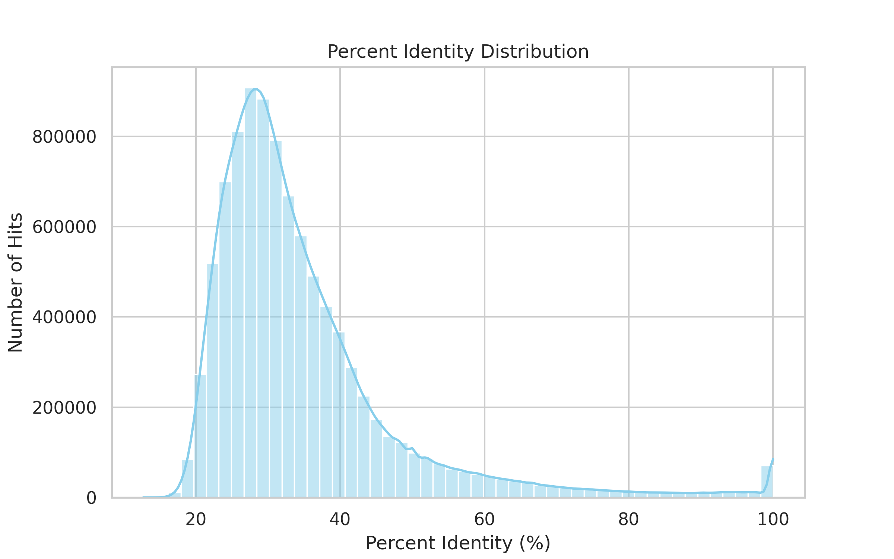

# Duplicated Genes

*currently looking into orientation analysis and circos configuration*

Associated with this part are the following scripts and analysis:
```
├── analysis/
│   └── duplicated_genes/
│       ├── explore_*.R     # -- just exploration no need to run
│       ├── load_variables.R
│       ├── plot_*.R        # -- plotting scripts
│       └── duplicated_genes.Rproj
└──scripts/
    ├── SETUP.sh
    ├── TAGs_compute.sh             # -- compute TAGs ratios for spacers 0-10 from TAGs_detect.R
    ├── TAGs_detect.R           # -- detect TAGs script
    ├── TAGs_get_list.sh            # -- get list of TAGs
    ├── TAGs_get_ratio.sh           # -- get TAGs counts and ratios for spacers 0-10
    ├── proximal_detect.R           # -- detect proximal gene pairs by family within a specified distance
    ├── blast_diagnostics.py        # -- blast diagnostics script
    ├── blast_top5_per_protein.py   # -- filter blast results to keep top 5 hits per protein
    ├── dups_get_ratio.sh           # -- get duplication ratios for
    ├── dups_info_filter.sh         # -- filter duplicated genes info out of prot_longest_info.csv
    └── extract_fasta.sh        # -- extract fasta sequences for each chromosome
```

**To keep the scripts/ dir as clean as possible, the name of each script shall begin with the main topic it addresses, e.g., TAGs_, dups_, extract_, etc. and that is because the code became too complex to create inner directories within scripts and the 1st goal is to keep everything complelty 100% reproducible and as orgaized as possible**

> [!TIP]
> In case wanted too replicate analyses, recommended to open the .Rproj file in RStudio to have all paths set correctly and run `load_variables.R` first to load all variables used in the analysis scripts

Relevant outputs:
```
output/
├── duplication_classes
│   ├── proximal
│   │   └── proximal_500kb.csv
│   └── TAGs
│       ├── TAGs_0.tsv
│       ├── TAGs_1.tsv
│       ├── TAGs_10.tsv
│       ├── TAGs_2.tsv
│       ├── TAGs_3.tsv
│       ├── TAGs_4.tsv
│       ├── TAGs_5.tsv
│       ├── TAGs_6.tsv
│       ├── TAGs_7.tsv
│       ├── TAGs_8.tsv
│       └── TAGs_9.tsv
├── gene_lists
│   ├── TAGs.txt
│   ├── largest_family.txt
│   └── singleton_genes.txt
└── statistics
    ├── TAGs_ratios.tsv
    ├── duplicated_genes_info.csv
    ├── duplication_ratios.tsv
    └── protein_info_longest.csv
```

## Methods to identify duplicated genes

The default thresholds used in our pipeline: 30% identity, 50% coverage => 99% of genes are duplicated genes (89598 isoforms, 56680 genes, 56144 out of them are duplicated genes)

In [^3], the work was performed on rice, with a relatively higher number of initial genes (42534, higher than arabidpsis studies and closer to our number), they used to filtering strategies:  
- 30% identity and 70% coverage => low stringency dataset (reduced to ~18k)
- 50% identity and 90% coverage => high stringency dataset (reduced to ~9k)

> [!TIP]
> maybe would consider the data we have as a low stringency dataset and then perform analysis using a high stringency one (like 70,90) to see how results change

Done some diagnostics plots on the blast results to see how identity and coverage are distributed (script:[`scripts/blast_diagnostics.py`](../scripts/blast_diagnostics.py))

| id distribution | coverage distribution | id vs coverage |
|-----------------|-----------------------|----------------|
|  |  |  |

Running pipeline on different thresholds to see how results change, by comparing number of duplicated genes in each file in `output/clusters/` containing gene families detected with different thresholds
```bash
./scripts/get_duplication_ratios.sh
# -- outputs in output/statistics/duplication_ratios.tsv this table
```
| id | cov | evalue | duplicated_genes | total_genes | duplication_ratio | largest_family_size |
| -- | --- | ------ | ---------------- | ----------- | ----------------- | ------------------- |
| 30 | 50  | 10e-10  | 52139            | 56679       | 91.98%            | 1326                |
| 30 | 50  | 1e-5   | 52516            | 56679       | 92.65%            | 1311                |
| 30 | 50  | NA     | 56145            | 56679       | 99.05%            | 1314                |
| 30 | 60  | 10e-10  | 51870            | 56679       | 91.51%            | 1324                |
| 30 | 60  | 1e-5   | 52227            | 56679       | 92.14%            | 1309                |
| 30 | 70  | 10e-10  | 51196            | 56679       | 90.32%            | 1320                |
| 30 | 70  | 1e-5   | 51526            | 56679       | 90.90%            | 1304                |
| 30 | 70  | NA     | 54271            | 56679       | 95.75%            | 1307                |
| 40 | 60  | 10e-10  | 51484            | 56679       | 90.83%            | 828                 |
| 40 | 60  | 1e-5   | 51814            | 56679       | 91.41%            | 842                 |
| 40 | 70  | 10e-10  | 50801            | 56679       | 89.62%            | 825                 |
| 40 | 70  | 1e-5   | 51101            | 56679       | 90.15%            | 840                 |
| 40 | 80  | 10e-10  | 49824            | 56679       | 87.90%            | 821                 |
| 40 | 80  | 1e-5   | 50085            | 56679       | 88.36%            | 835                 |
| 50 | 70  | 10e-10  | 50031            | 56679       | 88.27%            | 350                 |
| 50 | 70  | 1e-5   | 50280            | 56679       | 88.71%            | 357                 |
| 50 | 80  | 10e-10  | 49073            | 56679       | 86.58%            | 349                 |
| 50 | 80  | 1e-5   | 49290            | 56679       | 86.96%            | 355                 |
| 50 | 90  | 10e-10  | 48080            | 56679       | 84.82%            | 348                 |
| 50 | 90  | 1e-5   | 48261            | 56679       | 85.14%            | 354                 |
| 50 | 90  | NA     | 49334            | 56679       | 87.04%            | 360                 |
| 60 | 70  | 10e-10  | 48662            | 56679       | 85.85%            | 211                 |
| 60 | 70  | 1e-5   | 48863            | 56679       | 86.21%            | 214                 |
| 60 | 80  | 10e-10  | 47723            | 56679       | 84.19%            | 209                 |
| 60 | 80  | 1e-5   | 47897            | 56679       | 84.50%            | 212                 |
| 70 | 90  | 10e-10  | 44341            | 56679       | 78.23%            | 177                 |
| 70 | 90  | NA     | 44925            | 56679       | 79.26%            | 177                 |


*consider filtering by # of protein hits, [scripts/top5_per_protein.py](../scripts/top5_per_protein.py) for reference*

***MCScanX** is a widely used tool for detecting and classifying duplicated genes. It provides scripts to classify gene duplicates from blast results and gene position files. Tried to run it to check what results it might give*

> To run MCScanX try to follow these steps or else might give an error:
> * Create a folder called gm/ and put inside it gm.blast (renamed raw blast results with 12 columns) and gm.gff (gff of the shape: chr# start end gene_id)
> * gff taken from prot_longest_info.csv where peptide_id are taken as gene_id (or genomicRanges file taken from R, there s a command to create this file)
> * gff chr# should be of the form gm1, gm2, ..., gm20
> make sure both files are tab seperated and not space seperated
> * run MCScanX: `<path_to_mcscanx>/MCScanX <path_to_gm_dir>/gm`

Results from MCScanX:
```text
$ ./MCScanX gm
Reading BLAST file and pre-processing
Generating BLAST list
0 matches imported (9336543 discarded)
0 pairwise comparisons
0 alignments generated
Pairwise collinear blocks written to gm.collinearity [85.624 seconds elapsed]
Writing multiple syntenic blocks to HTML files
...
Done! [20.653 seconds elapsed]
```
```text
$ ./duplicate_gene_classifier gm
Reading BLAST file and pre-processing
Generating BLAST list
0 matches imported (9336543 discarded)
0 pairwise comparisons
0 alignments generated
Type of dup     Code    Number
Singleton       0       56181
Dispersed       1       0
Proximal        2       0
Tandem  3       0
WGD or segmental        4       0
```

It is also recommended by the tool developers to filter the BLAST results to keep only the top 5 hits per gene in a command like this (tried it but results not too different except for number of discarded matches is much less):

```bash
# tmux new -s mcscanx_blast
makeblastdb -in ../../data/peptides_longest.fa -dbtype prot -out peptides_db
blastp -query ../../data/peptides_longest.fa -db peptides_db   -evalue 10e-10 -max_target_seqs 5 -out gm.blast -outfmt 6
```


## Duplicated genes studies in _Glycine max_

Studies in Glycine max show the organism to have around 70-75% of its genes as duplicated genes [^4][^5], due to its paleopolyploid nature with 2 rounds of whole-genome duplications. Yang et al. (2013) [^5] performed their analysis on genomes taken from Plant Genome Duplication Database and used the MCScan tool to perform syntenic black dedtection, classification of dup genes and downstream analysis.

Most studies we found on duplicated genes in Glycine max were family-focused, i.e. they studied the duplication patterns of specific gene families such as PP2C, WRKY genes.., rather than performing a genome-wide analysis of duplicated genes. Some performed genome-wide analysis using BAC sequences and mapping to identify duplicates.


## Types of duplications

### Tandemly arrayed genes (TAGs)

| script  | description/plot |
|-------------|--------------------|
| [`scripts/detect_TAGs.R`](../scripts/detect_TAGs.R) | detect TAGs with a given spacer number |
| [`scripts/TAGs_get_ratio.sh`](../scripts/TAGs_get_ratio.sh) | automates detection for spacer numbers 0–10 (results in `output/duplication_classes/TAGs/TAGs_<spacer_number>.tsv`) |
| [`scripts/TAGs_get_list.sh`](../scripts/TAGs_get_list.sh) | get list of TAG genes from TAGs_1.tsv file |
| [`scripts/TAGs_pairs_orientation.R`](../scripts/TAGs_pairs_orientation.R) | analyze orientation of TAG gene pairs |
| [`analysis/duplicated_genes/plot_TAGs_distribution.R`](../analysis/duplicated_genes/plot_TAGs_distribution.R) | [](../analysis/duplicated_genes/plot_TAGs_distribution.R) |
| [`analysis/duplicated_genes/plot_TAGs_distribution.R`](../analysis/duplicated_genes/plot_TAGs_distribution.R) | [](../analysis/duplicated_genes/plot_TAGs_distribution.R) |
| [`analysis/duplicated_genes/plot_TAGs_distribution.R`](../analysis/duplicated_genes/plot_TAGs_distribution.R) | [](../analysis/duplicated_genes/plot_TAGs_distribution.R) |
| [`analysis/duplicated_genes/plot_chr_distribution.R`](../analysis/duplicated_genes/plot_chr_distribution.R) | [](../analysis/duplicated_genes/plot_chr_distribution.R)  |


#### Identification of TAGs by setting a gene spacer threshold

```bash
Rscript scripts/TAGs_compute.sh #-- takes arounf 4000 seconds (outputs the dir output/duplication_classes/TAGs/)
Rscript scripts/TAGs_get_list.sh
Rscript scripts/TAGs_get_ratio.sh
```

In this review [^1], Tandemly arrayed genes are defined as genes that are physically close on the chromosome and share high sequence similarity. As we have dealth previously with the definition of "sequence similarity" to be considered duplicated, what's left to define is "physically close". The gene spacer strategy revolves aroung setting a max spacer number, i.e. threshold of intervening genes, to consider two genes as tandemly duplicated. Usually this spacer number ranges between 0 (a perfect TAG cluster with no intervening genes) to 10, with 1, 5 and 10 being common choices. To choose ours, we refer to Shoja & Zhang (2006) [^2] who tried the 11 different spacer numbers from 0 to 11 on 3 different genomes (human, mouse, rat) and observed the increase in the number of TAGs detected with increasing spacer number. 

We tried the same approach on our data, running the detection of TAGs with spacer numbers from 0 to 10 and plotting the results. We observed a similar trend as in[^2], with a rapid increase in the number of TAGs detected from spacer 0 to 1, then a slower one follows. Bsed on the same approach, we will consider spacer number 1 as our threshold to define TAGs in our data, this is from running the script `script/compute_TAGs.sh` which uses the R script `scripts/detect_TAGs.R` to detect TAGs with a given spacer number on 0:10 range (can be found in `output/statistics/TAGs_ratios.tsv`)

| spacer | n_TAG_genes | n_TAG_arrays | ratio_TAG_genes |
|--------|-------------|--------------|-----------------|
| 0      | 8326        | 1201         | 0.14689 |
| 1      | 9627        | 1326         | 0.16985 |
| 2      | 10150       | 1371         | 0.17907 |
| 3      | 10475       | 1396         | 0.18481 |
| 4      | 10663       | 1408         | 0.18812 |
| 5      | 10826       | 1417         | 0.19100 |
| 6      | 10977       | 1423         | 0.19366 |
| 7      | 11102       | 1427         | 0.19587 |
| 8      | 11244       | 1432         | 0.19838 |
| 9      | 11357       | 1436         | 0.20037 |
| 10     | 11455       | 1441         | 0.20210 |


[](../analysis/duplicated_genes/plot_TAGs_distribution.R) 

So for tags, as spacer 1 is chosen, the file [`output/duplication_classes/TAGs/TAGs_1.tsv`](../output/duplication_classes/TAGs/TAGs_1.tsv) will be used in downstream analysis (seqnames is chr# btw)

#### Orientation of TAG gene pairs

```bash
Rscript scripts/TAGs_pairs_orientation.R # -- outputs output/duplication_classes/TAGs/TAGs_gene_pairs.tsv + prints orientation summary and chi-squared test results
```

TAGs can be classified into three categories based on the relative orientation of the genes in the pair: tandem (→ → or ← ←), convergent (→ ←), and divergent (← →). The orientation of TAG gene pairs can provide insights into their evolutionary history and functional relationships.  
As TAGs originate from duplicated genes that are positioned next to each other on a chromosome, and unequal crossing-over (UCO) is a recombination-based process in which misaligned homologous chromosomes exchange genetic material, generating these tandem duplicates typically in direct orientation.
According to Rizzon et al (2006) [^6], tandemly arrayed genes (TAGs) are predominantly arranged in direct orientation, reflecting the influence of unequal crossing-over (UCO) as a major mechanism generating TAGs. It showed that around 80% of TAGs in rice and 88% in Arabidopsis are in direct orientation, suggesting that UCO is likely the primary driver of tandem gene duplication, although other evolutionary processes such as selection, recombination, gene gain, and loss may also play a role.  
In fact, Shoja & Zhang (2006) [^2] also observed that in human, mouse, and rat genomes, the majority of TAGs are arranged in direct orientation, with percentages being 68%, 76%, and 72%, respectively. And they performed a chi-squared test to confirm the significance of these percentages compared to what would be expected by chance.

Here, we want to analyze the orientation of out TAG gene pairs (file: [`output/duplication_classes/TAGs/TAGs_1.tsv`](../output/duplication_classes/TAGs/TAGs_1.tsv)) to see if they follow the same trend as in [^6].   
Used the script [`scripts/TAGs_pairs_orientation.R`](../scripts/TAGs_pairs_orientation.R):
* creates a pairs file in [`output/duplication_classes/TAGs/TAGs_gene_pairs.tsv`](../output/duplication_classes/TAGs/TAGs_gene_pairs.tsv) to analyze the orientation of TAG gene pairs
* performs a goodness of fit test to see if the observed orientation frequencies differ significantly from the expected frequencies

| orientation | count | percentage |
|-------------|-------|------------|
| tandem      | 12178 | 80.7       |
| convergent  | 1545  | 10.2       |
| divergent   | 1365  | 9.05       |

Performing a chi-squared test to see if the observed orientation frequencies differ significantly from the expected frequencies (assuming equal distribution among the three orientations):

- **Data:** observed *(expected is based on 50% tandem, 25% convergent, 25% divergent)*
- **Chi-squared statistic (X²):** 5697.3  
- **Degrees of freedom (df):** 2  
- **p-value:** < 2.2 × 10⁻¹⁶

*table and results copied from Rscript output*

The extremely low p-value indicates that the observed distribution of TAG gene pair orientations is significantly different from what would be expected by chance, suggesting a strong bias towards tandem orientation among TAGs in this dataset.

### Proximal and dispersed duplications

Proximal can be defined as duplicated genes that are seperated by a few number of genes/kbs on the same chromosome, while dispersed are duplicated genes that are located far away on the same chromosome or on different chromosomes. To consider proximal will first need to define a threshold ideally in kbs distance (unlike tandem where it's more about genes - higher resolution), and then remove from this set the TAGs already detected. The rest that are not TAGs nor proximal will be considered dispersed (would rethink their classification according to WGDs)

```bash
Rscript scripts/proximal_detect.R -help
``` 

The script in [`scripts/proximal_detect.R`](../scripts/proximal_detect.R) detects proximal gene pairs based on a specified maximum distance in kilobases (default is 500 kb). It takes as input a gene annotation CSV file (like [`output/statistics/duplicated_genes_info.csv`](../output/statistics/duplicated_genes_info.csv)) and a family mapping TSV (from [`output/clusters/`](../output/clusters/)) file, and outputs a CSV file containing the proximal gene pairs within the specified distance.

(running overnight, will commit results later)

### Whole-genome duplications (WGDs)

Based on Ks plot and values, startegy first:
* detect WGD events at peaks
* define Ks ranges for each WGD event
* classify duplicated genes based on their Ks values into WGD-derived or not

## Transposable elements and duplicated genes

It's either about studying transposed duplications or rather focus on richness of TEs around duplicated genes based on coverage and windows or something like that. Check [this article for mme rizzon](https://academic.oup.com/gbe/article/13/5/evab062/6273345#303241768) that split duplicated genes based on their TE richness, also [this "one code to find them all": a perl tool to parse RepeatMasker output files](https://link.springer.com/article/10.1186/1759-8753-5-13#Abs1) if it helps


For windows and coverage computation, there are:  
* bash - bedtools coverage and bedtools makewindows programs
* R - GenomicRanges, slidingWindows and countOverlaps functions (might be slower than bedtools) 

For retrieving sequences from coordinated (bed/gff) cna use the following R packages from Bioconductor:
* rtracklayer (imports gff/bed files)
* GenomicRanges works with coordinates
* BSgenome package to load genome sequences in R
* Biostrings package to extract sequences

## Ideas

- [ ] try circos to plot duplicated genes links on chromosomes (might be a lot of links => consider largest family or only TAG links for example, or show distribution in heatmap form)

*Still configuring how to use the tool :')*

[^1]: Lallemand, T., Leduc, M., Landès, C., Rizzon, C., & Lerat, E. (2020). An overview of duplicated gene detection methods: why the duplication mechanism has to be accounted for in their choice. Genes, 11(9), 1046.  
[^2]: Shoja, V., & Zhang, L. (2006). A roadmap of tandemly arrayed genes in the genomes of human, mouse, and rat. Molecular biology and evolution, 23(11), 2134-2141.
[^3]: Lallemand, T., Leduc, M., Landès, C., Rizzon, C., & Lerat, E. (2020). An overview of duplicated gene detection methods: why the duplication mechanism has to be accounted for in their choice. Genes, 11(9), 1046.
[^4]: Kim, K. D., El Baidouri, M., Abernathy, B., Iwata-Otsubo, A., Chavarro, C., Gonzales, M., ... & Jackson, S. A. (2015). A comparative epigenomic analysis of polyploidy-derived genes in soybean and common bean. Plant Physiology, 168(4), 1433-1447.
[^5]: Yang, Y., Wang, J., & Di, J. (2013). Comparative inference of duplicated genes produced by polyploidization in soybean genome. International journal of genomics, 2013(1), 275616.
[^6]: Rizzon, C., Ponger, L., & Gaut, B. S. (2006). Striking similarities in the genomic distribution of tandemly arrayed genes in Arabidopsis and rice. PLoS computational biology, 2(9), e115.

"Genes without hits that met a threshold of e-value 10e-10 were deemed singletons"