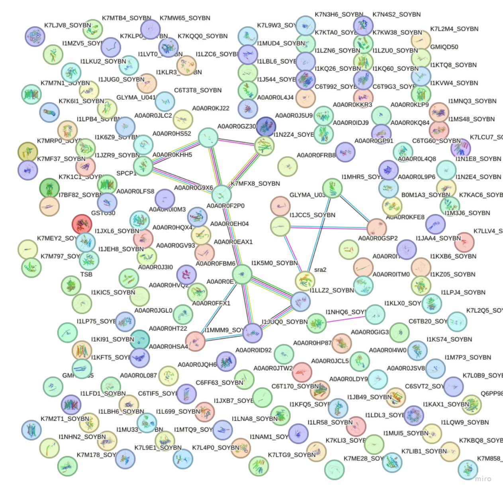
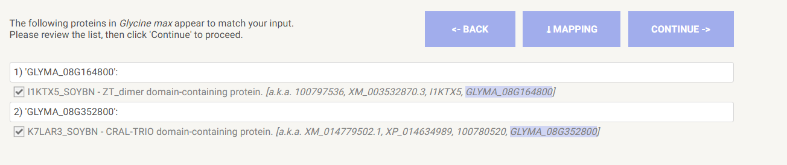
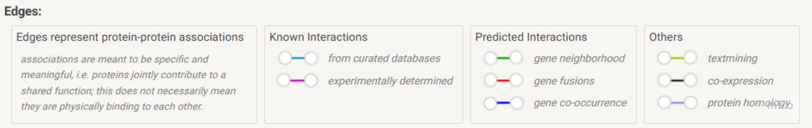

# comparative-genomics-project

[todo list for this project](TODO.md)

## Important notes

> [!CAUTION]
> never at any cost merge two branches together (at least discuss first), i.e. the command `git merge...` should never be used in this project. Always work in one branch, if something is needed from another branch, first discuss it, will be made available in a proper way (risk of deleting files or messing up the code otherwise)

The main directories to be aware of in master branch
```text
.
├── TODO.md             # -- general todo list
├── analysis
│   ├── Ks
│   ├── code.Rproj
│   └── duplicated_genes
├── data                # -- large data_files (hidden)
├── docs                # -- documentation files (some notes if you wanna add something)
├── output              # -- output files and results of pipelines and codes
├── pipeline            # -- overall pipeline structure (merge of all sub-pipelines)
├── pipeline_1          # -- pipeline from raw to duplicated genes
├── pipeline_2          # -- next pipeline stage: from dup genes to Ks computation
├── requirements.txt    # -- python packages installed for this project
└── scripts             # -- scripts used for seperate tasks in the project
```
<!-- 
> To mark a change you've added or done to the project, please commit with a clear message on what was changed and run  
> ``` ./dev/version_tracker.sh ```, follow the instructions (choose an option - default z unless you did a big change, write each step you've done in a seperate line and the press `ENTER` to get out of the prompt => version will be updated automatically)
 -->

At the end all of our works will be merged in the `main` branch, this is why preserving these main directory names is essential to avoid conflicts.

Each specific branch will have a specific readme.md with an `examples` folder containing example data files to test the code and pipelines.

## PPI

from gene families of duplicated genes, we want to retrieve their PPI (protein-protein interaction) data from STRING database (so taking the geneIDs of duplicated genes as input)

Until now (since no gene families yet), we have in the folder `data/` the following files:

```
data/
├── protein_info.csv
└── protein_info_longest.csv
```

They both contain the same kindof information, which is mainly metadata about each protein of Glycine max taken from the proteome fasta file:

| peptide_id | gene_id         | transcript_id | genome             | chromosome | start_pos | end_pos  | strand | description         | length |
|------------|-----------------|---------------|--------------------|------------|-----------|----------|--------|----------------------|--------|
| KRH43692   | GLYMA_08G164800 | KRH43692      | Glycine_max_v2.0   | 8          | 12977614  | 12982018 | -1     | hypothetical protein | 396    |
| KRH46721   | GLYMA_08G352800 | KRH46721      | Glycine_max_v2.0   | 8          | 46595288  | 46603445 | -1     | hypothetical protein | 560    |


After getting the gene families, the output file will be of the same format but only containing the genes of interest (duplicated genes) - so a more filtered list but of the same format.

A couple of notes seen from a first glance on STRING database:

* the peptide_id column is not recognized when search for interaction of a specific gene/protein, only the gene_id column is recognized (so `GLYMA_08G164800` instead of `KRH43692`)

check [this query for instance](https://string-db.org/cgi/network?taskId=b7Fo71fHXPrZ&sessionId=b8M0Vc7GbNva): this is the result of putting `GLYMA_08G164800` in the search box (and selecting Glycine max as organism: try it on https://string-db.org/).  


* Can serach by multiple proteins at once, so can give a list of gene_ids one per line, like this:

```
GLYMA_08G164800
GLYMA_08G352800
```
Will give PPI between each other:  


* In an output of a query can have the following output file which can be found after submitting the list directly here (mapping)

```
#queryIndex queryItem stringId preferredName annotation
1 GLYMA_07G140400 3847.I1KK66 GSTU30 Uncharacterized protein; Belongs to the GST superfamily.
```
Notice it contains a preferredName column which is the a preferred name for the protein (can also be linked to uniport maybe, if needed later for annotation or smtg)

* There is an API which means it can be automated in code. Especially ideal since we do not have the full list yet of duplicated genes.
StringDB has an API that can be used to retrieve PPI data from list of genes, but still not fully tested.
Can check [this script based from their api website for reference](./scripts/retrieve_ppi.py)
* Types of edges (dont know if relevant)  
  

So in general from geneID (from protein_info.csv file) $\rightarrow$ map on stringDB $\rightarrow$ string ID, protein name, annotation  + network of PPI between each other

Code could be added to `analysis/ppi/`, as for scripts maybe in `scripts/` (or whatever is more relevant)