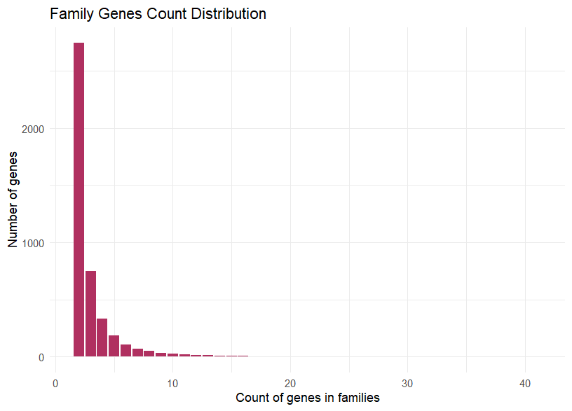

# comparative-genomics-project

The main directories to be aware of in main branch
```text
.
├── TODO.md     # -- general todo list
├── analysis
│   ├── Ks
│   ├── code.Rproj
│   └── duplicated_genes
├── data        # -- large data_files (hidden)
├── docs       # -- documentation files (some notes if you wanna add something)
├── output     # -- output files and results of pipelines and codes
├── pipeline   # -- overall pipeline structure (merge of all sub-pipelines)
├── pipeline_1  # -- pipeline from raw to duplicated genes
├── pipeline_2  # -- next pipeline stage: from dup genes to Ks computation
├── requirements.txt    # -- python packages installed for this project
└── scripts     # -- scripts used for seperate tasks in the project
```
<!-- 
> [!IMPORTANT]  
> To mark a change you've added or done to the project, please commit with a clear message on what was changed and run  
> ``` ./dev/version_tracker.sh ```, follow the instructions (choose an option - default z unless you did a big change, write each step you've done in a seperate line and the press `ENTER` to get out of the prompt => version will be updated automatically)
 -->

At the end all of our works will be merged in the `master` branch, this is why preserving these main directory names is essential to avoid conflicts.

Each specific branch will have a specific readme.md with an `examples` folder containing example data files to test the code and pipelines.

## General Analysis Branch

There are 2 types of analysis handled in this branch, with their respective folders in `analysis/`:
```
analysis/
├── Ks
└── duplicated_genes
```


### 1. Duplicated Genes

This is analysis_1 after retrieving the duplicated genes (clustering step)

2 example output files of clustering are provided:
```
examples/
├── clustering_output.txt
└── clustering_output_2.txt
```

These files represent 2 different formats of clustering output, the first one is the default output of `mcl` program `clustering_output.txt`:

```
AT1G12630.1     AT1G01250.1     AT1G21910.1     AT1G33760.1AT1G36060.1      AT1G44830.1     AT1G46768.3     AT1G68550.1AT1G71450.1      AT1G77200.1     AT2G23340.1     AT2G25820.1AT2G35700.1      AT2G36450.1     AT2G40220.1     AT2G44940.1AT3G16280.2      AT3G16770.1     AT3G50260.1     AT4G06746.1AT4G16750.1      AT4G31060.1     AT4G32800.1     AT4G36900.1AT5G07580.1      AT5G11590.1     AT5G25810.1     AT5G51990.1AT5G52020.1      AT5G61590.1     AT5G67190.1     AT1G04370.1AT1G03800.1      AT1G06160.1     AT1G12890.1     AT1G12980.1AT1G15360.2      AT1G22985.1     AT1G28160.1     AT1G28360.1AT1G28370.1      AT1G43160.1     AT1G50640.1     AT1G53170.1AT1G72360.1      AT1G80580.1     AT2G31230.1     AT2G33710.1AT2G44840.1      AT2G46310.1     AT2G47520.1     AT3G15210.1AT3G20310.1      AT3G23220.1     AT3G23230.1     AT3G61630.1AT4G17490.1      AT4G18450.1     AT4G23750.2     AT4G34410.1AT5G07310.1      AT5G13330.1     AT5G13910.1     AT5G18560.1AT5G43410.1      AT5G47220.1     AT5G47230.1     AT5G50080.1AT5G51190.1      AT5G61600.1     AT5G61890.1     AT5G64750.1AT1G22190.1      AT1G24590.1     AT1G49120.1     AT1G53910.2AT1G64380.1      AT1G78080.1     AT2G20350.1     AT2G20880.1AT2G22200.1      AT3G11020.1     AT3G14230.1     AT3G23240.1AT4G11140.1      AT4G13620.1     AT4G17500.1     AT4G27950.1AT4G28140.1      AT4G39780.1     AT5G05410.1     AT5G25390.1AT5G44210.1      AT5G53290.1     AT5G65130.1     AT5G67000.1AT3G25890.1      AT3G57600.1     AT3G60490.1     AT5G19790.1AT1G12610.1      AT1G63030.2     AT4G25470.1     AT4G25490.1AT2G40340.1      AT5G25190.1     AT5G67010.1     AT4G25480.1AT5G18450.1      AT1G19210.1     AT5G21960.1     AT1G71130.1AT1G74930.1      AT1G75490.1     AT2G38340.1     AT2G40350.2AT1G22810.1      AT1G71520.1     AT1G25470.1     AT5G11190.1AT1G77640.1      AT4G13040.1
AT1G08810.3     AT1G06180.1     AT1G09540.1     AT1G16490.1AT1G18570.1      AT1G18710.1     AT1G22640.2     AT1G34670.1AT1G35515.1      AT1G56160.1     AT1G57560.2     AT1G66230.1AT1G66380.3      AT1G74080.1     AT1G74650.2     AT1G79180.1AT2G16720.1      AT2G31180.1     AT2G32460.1     AT2G36890.1AT2G47460.1      AT3G01140.1     AT3G01530.1     AT3G02940.1AT3G08500.1      AT3G12720.1     AT3G12820.2     AT3G13540.1AT3G24310.1      AT3G27810.2     AT3G30210.1     AT3G47600.1AT3G62610.1      AT4G01680.1     AT4G05100.1     AT4G12350.1AT4G13480.1      AT4G17785.2     AT4G21440.1     AT4G22680.1AT4G25560.2      AT4G28110.1     AT4G34990.1     AT4G38620.1AT5G06100.3      AT5G07690.1     AT5G07700.2     AT5G10280.1AT5G12870.1      AT5G14340.2     AT5G15310.4     AT5G16600.1AT5G16770.4      AT5G26660.1     AT5G35550.2     AT5G40330.1AT5G40350.1      AT5G49330.1     AT5G52260.1     AT5G54230.1AT5G55020.1      AT5G56110.1     AT5G60890.1     AT5G61420.2AT5G62470.1      AT5G65230.1     AT1G63910.1     AT1G66390.1AT1G68320.1      AT2G26960.1     AT2G47190.1     AT3G11440.4AT3G13890.1      AT3G23250.1     AT3G28470.1     AT3G28910.2AT3G46130.1      AT3G49690.1     AT3G53200.1     AT4G09460.1AT4G26930.1      AT4G37780.1     AT5G23000.1     AT5G59780.1AT5G62320.1      AT5G65790.1     AT3G48920.1     AT3G61250.1AT5G57620.1      AT1G48000.1     AT3G27920.1     AT5G14750.1AT1G56650.1      AT1G25340.2     AT3G06490.1     AT5G49620.2AT1G66370.1      AT1G71030.1     AT1G74430.2     AT2G26950.1
AT3G58910.1     AT1G19070.1     AT4G22280.2     AT5G38565.1AT1G19410.1      AT1G58310.1     AT3G58950.1     AT4G00320.1AT5G02910.1      AT5G38390.1     AT5G38392.1     AT1G52650.1AT3G59000.1      AT4G13960.4     AT5G38396.1     AT1G55660.2AT3G29830.2      AT4G00315.1     AT4G14096.1     AT3G59180.1AT2G14070.1      AT3G59190.2     AT3G59210.5     AT3G59230.1AT4G14103.2      AT5G41830.2     AT2G26860.1     AT2G42720.1AT3G03040.1      AT3G03030.2     AT3G58930.5     AT3G44090.1AT3G44060.1      AT3G42770.1     AT3G44180.1     AT3G44810.1AT3G44080.1      AT3G58900.4     AT3G58820.1     AT3G58940.2AT3G58860.1      AT3G58880.1     AT3G58875.1     AT3G58920.1AT3G58980.1      AT3G59150.1     AT3G59160.1     AT3G59170.1AT3G59200.2      AT3G59240.1     AT3G59250.1     AT5G18770.2AT5G18780.4      AT3G62440.1     AT5G41840.1     AT4G09920.1AT4G10400.1      AT4G10410.1     AT4G10420.1     AT4G26340.1AT4G26350.1      AT5G22670.1     AT5G35926.1     AT5G38386.2AT5G22590.1      AT5G54820.1     AT5G56380.1     AT5G60610.2AT5G56420.1      AT5G56820.1
AT1G61360.4     AT1G11280.4     AT1G61370.2     AT1G61380.2AT1G61390.1      AT1G61400.1     AT1G61420.5     AT1G61430.2AT1G61440.1      AT1G61460.1     AT1G61480.1     AT1G61490.6AT1G61500.1      AT1G61550.1     AT1G11410.4     AT1G11340.1AT4G11470.2      AT4G23210.5     AT4G23250.3     AT4G23290.2AT4G23320.3      AT1G61475.1     AT4G00960.4     AT3G45860.1AT4G23270.1      AT4G11460.1     AT4G23130.2     AT4G23160.1AT4G23190.1      AT4G23230.1     AT4G23260.2     AT4G23280.1AT4G23310.2      AT4G00970.1     AT4G04490.1     AT4G04500.1AT4G04510.2      AT4G04540.4     AT4G04570.1     AT4G11490.1AT4G11530.1      AT4G21230.1     AT4G21400.1     AT4G21410.3AT4G23140.2      AT4G23150.1     AT4G23200.1     AT4G23220.1AT4G27300.1      AT4G38830.1     AT4G05200.1     AT4G11480.4AT4G11900.10     AT4G11521.1     AT4G23170.1     AT4G23300.1AT4G23240.1
AT1G52880.1     AT1G01720.1     AT1G52890.1     AT1G61110.1AT1G77450.1      AT3G04070.2     AT3G04410.1     AT3G15500.1AT3G15510.1      AT5G08790.1     AT5G63790.2     AT1G02220.1AT3G04420.1      AT1G02250.1     AT1G02230.1     AT1G19040.1AT1G32770.1      AT1G12260.2     AT1G33280.1     AT1G62700.2A
```

Each line in it represents a gene cluster or gene family, with gene IDs belonging to that cluster separated by tabs `"\t"`

The second one is a modified version with gene IDs and family number separated by tabs `"\t"` in `clustering_output_2.txt`:

```
geneName        family
AT4G01510.1     2
AT1G01020.1     2
AT2G46870.1     3
AT1G01030.2     3
AT3G61970.1     4
```

This means, first 2 genes here belong to teh same family (family 2), the next 2 genes belong to family 3, and the last gene belongs to family 4...

You can use either of this files to run the analysis in `analysis/duplicated_genes/` folder.
(They are equivalent, whatever is easier for you to use)

One analysis plot she asked to do in TD1 was to plot the distribution of gene family sizes (number of genes per family):



I think it might be easier to do in R.

### 2. Ks Computation

Will provide another data file once we reach that step in the pipeline